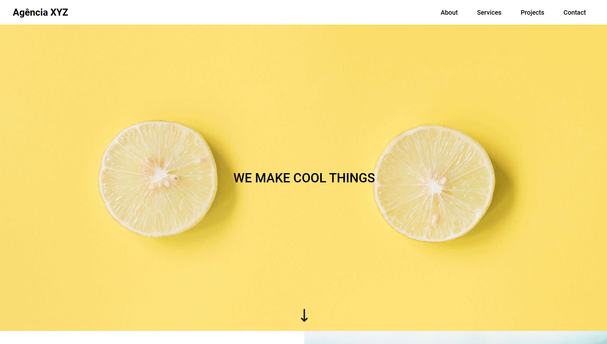
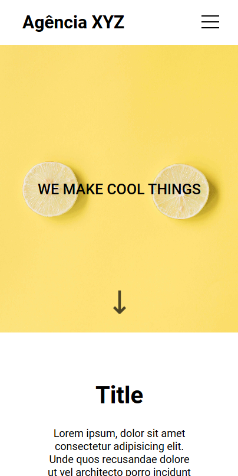

# Agência XYZ Landing Page 🚀🌐

## 📌 Table of Contents 

- [Overview](#-overview)
- [Challenge Description](#-challenge-description)
- [Technologies Used](#-technologies-used)
- [What I Learned](#-what-i-learned)
- [Key Takeaways](#-key-takeaways)
- [Project Screenshots](#-project-screenshots)
- [Useful Links](#-useful-links)
- [Contributing](#-contributing)
- [Contact](#-contact)

## 🌐 Overview

This project is a landing page template. The goal was to design and develop a visually appealing landing page for the agency, showcasing its services and projects.

## 📝 Challenge Description

The challenge included the following tasks:

- Designing and developing a responsive landing page layout with sections for about, services, projects, and contact.
- Implementing a navigation menu with smooth scrolling functionality.
- Incorporating visually appealing images and content to highlight the agency's offerings.
- Creating a responsive footer with social media links for easy navigation.

## 💻 Technologies Used

- HTML5
- CSS3
- Font Awesome
- Google Fonts

## 🌱 What I Learned

One of the key learnings from this project was designing and implementing a responsive navigation menu using CSS grid and flexbox.

## 🚀 Key Takeaways

- Understanding the importance of responsive design for providing a seamless user experience across various devices.
- Implementing smooth scrolling functionality for enhanced navigation.
- Utilizing CSS grid and flexbox for creating flexible and responsive layouts.

## 🖼️ Project Screenshots

### Desktop Screenshot:

### Mobile Screenshot:

## 🔗 Useful Links

- [Live Demo](https://cauebf.github.io/Landing-Page-Agencia-XYZ/)
- [Project Repository](https://github.com/Cauebf/Landing-Page-Agencia-XYZ)

## 🤝 Contributing

Contributions are welcome! Feel free to open issues or pull requests for any improvements or bug fixes.

## 💬 Contact 

For any inquiries or collaboration opportunities, feel free to reach out via:

(<a href="#agência-xyz-landing-page-">back to top</a>)

